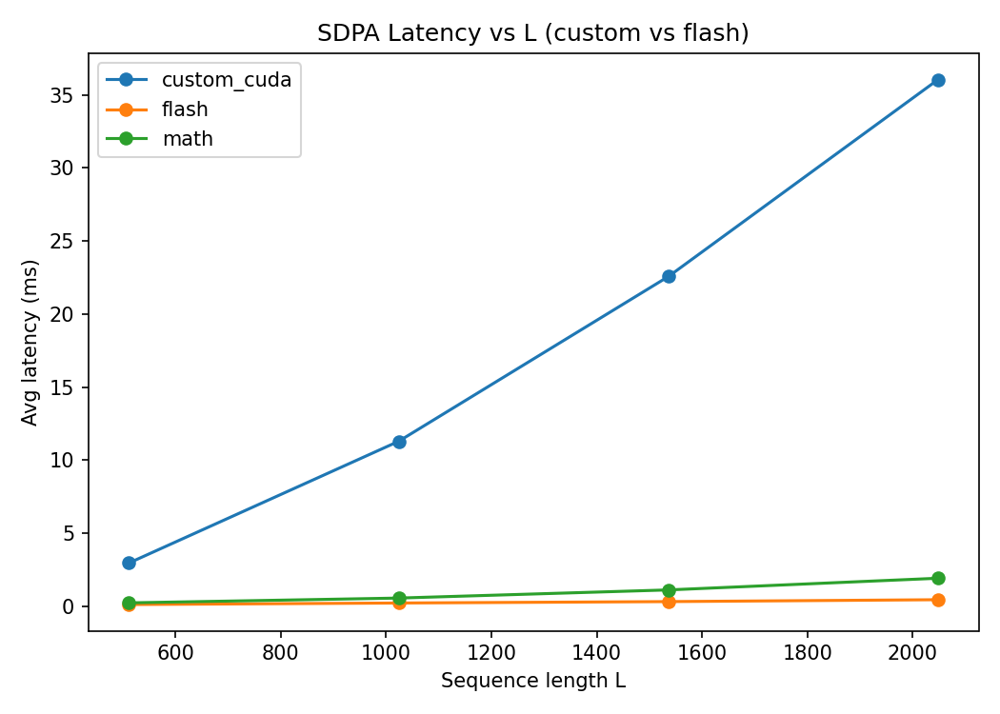
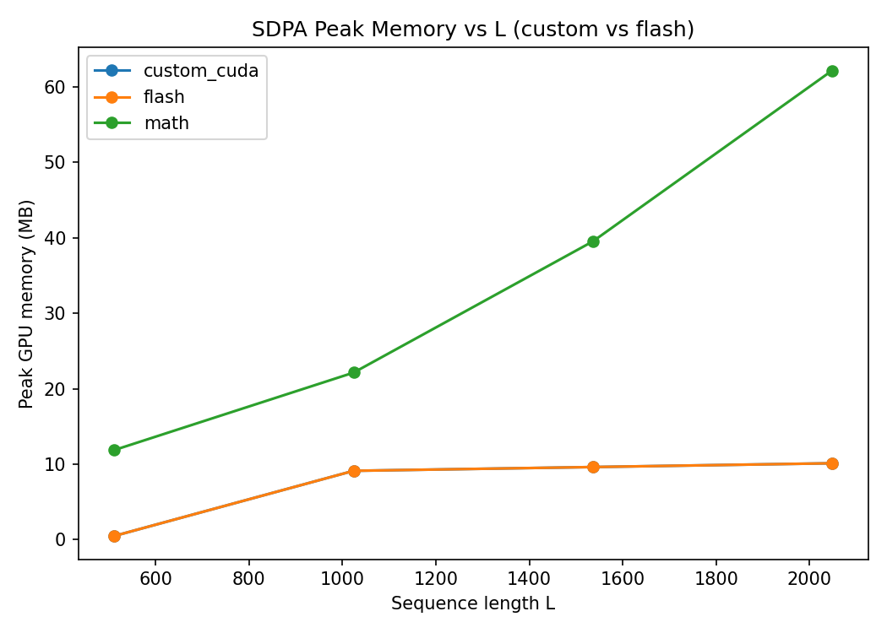

# FlashSDPA‑Mini: A Minimal, Measurable FlashAttention (SDPA) Kernel

> **Tagline:** Reproduce FlashAttention’s *memory scaling* end‑to‑end on a single file CUDA kernel, benchmarked against PyTorch SDPA (flash & math), with clean plots and a clear optimization roadmap.

A compact project that implements a **tile‑wise, online‑softmax** attention kernel in CUDA (via CuPy NVRTC), plugs it into a tiny PyTorch benchmarking harness, and **plots latency & memory vs. sequence length**. The current kernel is an **MVP** focused on correctness and memory behavior. It *already* matches PyTorch FlashAttention’s **GPU memory footprint** while leaving headroom to chase its **latency** through staged optimizations (O1 → O3).

This repository is intentionally small: one custom CUDA kernel, one launcher, one benchmark script, and one PyTorch baseline. Perfect for interviews and as a starting point for low‑level GPU performance work.

---

## ✨ What’s inside

* **Custom Flash‑style SDPA kernel (CUDA)**

  * Blocked K/V tiles + **online softmax** (no L×L scores stored)
  * Warp‑collaborative dot product & stable running max/sum
  * Designed to run on older GPUs (e.g., GTX1060 / Pascal, no `cp.async` required)
* **Side‑by‑side baselines**: `torch.nn.functional.scaled_dot_product_attention` with `flash` and `math` kernels
* **One‑command benchmark**: sweeps sequence length and logs **average latency** & **peak GPU memory**
* **Out‑of‑the‑box plots**: `results/latency_vs_L.png`, `results/memory_vs_L.png`
* **Lean codebase** you can read in one sitting and extend during interviews

---

## 🧪 Headline results (GTX1060, FP32, dhead=64, B=H=1)

> Latency shown here is from the quick sweep (light preset). Memory is peak allocation during the sweep. Numbers will vary across systems; these are representative of the included plots.

| L (seq len) | **Flash (PyTorch)** | **Math (PyTorch)** | **Custom CUDA (MVP)** |
| :---------: | :-----------------: | :----------------: | :-------------------: |
|     512     |      \~0.10 ms      |   \~0.22–0.28 ms   |        \~3–4 ms       |
|     1024    |      \~0.20 ms      |      \~0.54 ms     |       \~11–12 ms      |
|     1536    |      \~0.30 ms      |      \~1.1 ms      |       \~23–25 ms      |
|     2048    |    \~0.43–0.46 ms   |    \~1.9–2.0 ms    |       \~36–38 ms      |

**Key observation:** the **Custom CUDA** kernel already **matches FlashAttention’s memory curve** (near‑linear w\.r.t L), while latency still trails cuBLAS‑backed PyTorch kernels. That gap is the point of the optimization roadmap.

---

## 📈 Reproducing the plots

**Artifacts included in this repo** (generated on GTX1060, your numbers may differ):

<p align="center">
  
  
</p>

CSV with raw data: `results/sdpa_Lsweep_B1_H1_d64_fp32.csv`.

\-----------:|:-------------------:|:------------------:|:---------------------:|
\|  512        | \~0.10 ms            | \~0.22–0.28 ms      | \~3–4 ms               |
\| 1024        | \~0.20 ms            | \~0.54 ms           | \~11–12 ms             |
\| 1536        | \~0.30 ms            | \~1.1 ms            | \~23–25 ms             |
\| 2048        | \~0.43–0.46 ms       | \~1.9–2.0 ms        | \~36–38 ms             |

**Key observation:** the **Custom CUDA** kernel already **matches FlashAttention’s memory curve** (near‑linear w\.r.t L), while latency still trails cuBLAS‑backed PyTorch kernels. That gap is the point of the optimization roadmap.

---

## 🧠 Why this project matters (for interviews & real work)

1. **Memory‑scaling demonstrated**: The MVP reproduces FlashAttention’s *core idea*—compute attention **without materializing L×L scores**.
2. **Measurable, repeatable baseline**: Simple scripts produce CSVs & plots, making progress concrete as you optimize.
3. **Pedagogical & portable**: No giant framework or binding layers; CuPy + NVRTC loads a single `.cu` file.
4. **Optimization playground**: Clear next steps (vectorization, register blocking, double buffering) to close the gap with cuBLAS/Flash.

---

## 📦 Repository layout

```
.
├─ baselines/
│  └─ sdpa_pytorch.py         # PyTorch SDPA wrapper (flash / math)
├─ bench/
│  └─ bench_l_sweep.py        # L-sweep benchmark → CSV + plots
├─ cuda/
│  ├─ launcher.py             # CuPy NVRTC loader + kernel launcher
│  └─ sdpa_tiled16.cu         # Custom Flash-style SDPA kernel (MVP)
├─ results/                   # Auto-generated CSV/plots
├─ README.md
└─ requirements.txt
```

---

## 🚀 Quick start

**Prereqs**

* NVIDIA GPU + CUDA driver
* **CUDA Toolkit** installed (for NVRTC include paths)
* Python 3.10+ (tested) with `torch` (CUDA build) and `cupy-cudaXX` that matches Torch’s CUDA version

**Install**

```bash
pip install -r requirements.txt
```

**Run (fast preset)**

```bash
python -m bench.bench_l_sweep --device cuda
```

This runs a light sweep (L=512..2048) and produces:

* `results/sdpa_Lsweep_B1_H1_d64_fp32.csv`
* `results/latency_vs_L.png`
* `results/memory_vs_L.png`

**Run (full sweep)**

```bash
python -m bench.bench_l_sweep --device cuda --full
```

> **Note:** The custom kernel MVP currently assumes `B=H=1`, `D<=64`, FP32. The baselines are general.

---

## 🧩 Kernel design (MVP)

* **Tiling over K/V**: process keys/values in blocks of `BLOCK_N` tokens; each block is staged in shared memory with +1 padding to reduce bank conflicts.
* **Warp-collaborative dot**: 1 warp collaboratively computes a query row’s dot products against the current K tile, then writes scores to shared memory once per tile.
* **Online softmax**: per row maintain running `(m, l)` where `m` is the running max, `l` is the renormalized sum of exponentials; ensures stability and no L×L storage.
* **Causal masking**: applied inline before exponentiation.
* **Accumulator in registers**: each lane maintains 1–2 output channels in registers; accumulation is rescaled tile-by-tile; only **one global store at the end**.

**Why memory matches Flash:** avoiding materialized QK and using online softmax reduces intermediate memory from **O(L²)** to **O(L · d\_head + tile)**. The plots show `custom_cuda` overlapping the `flash` memory curve.

---

## 🧭 Optimization roadmap

The MVP focuses on the algorithmic structure. To close the latency gap to `math/flash`, implement these **staged** upgrades (each with profiler screenshots & numbers):

* **O1 – Parallelism & Overheads**

  * Ensure `grid=(1, ceil(L/2))` (kernel loops over K/V tiles internally; do not multiply work in grid.x)
  * Tune `BLOCK_N` for occupancy on Pascal (often **32** beats 64 due to shared-mem limits)
  * Remove any per-tile global reads/writes of `Out`

* **O2 – Memory Throughput**

  * **Float4 vectorized loads/stores** for K/V (requires `d_head % 4 == 0` → true for 64)
  * Cache per-lane Q channels (`d0, d1`) in registers; avoid repeated global reads of Q
  * Reduce shared traffic for scores: keep in registers when tile length allows, or compress to FP16

* **O3 – Pipeline & Compute Utilization**

  * **Double-buffer** K/V tiles in shared memory (overlap global loads with compute)
  * **Register blocking** per lane (e.g., 2×2 outputs) to raise math/byte
  * Consider a small epilogue fusion if you add bias/dropout variants

Each step should cut a clear bottleneck (memory transactions → stalls → occupancy). The provided benchmark scripts will reflect progress in the plots.

---

## 📈 Reproducing the plots

* **Latency vs L** compares average time per forward across backends (`custom_cuda`, `flash`, `math`).
* **Peak memory vs L** uses `torch.cuda.max_memory_allocated()` to show the O(L) vs O(L²) behavior.

Example artifacts (your numbers will vary):


CSV with raw data: `results/sdpa_Lsweep_B1_H1_d64_fp32.csv`.

---

## ⚙️ Tuning & environment variables

The launcher honors a few env vars for quick experiments (Windows PowerShell examples):

```powershell
# Debug print launch config once
$env:FLASH_DEBUG = "1"

# Shared memory budget (KB) per block (Pascal SM ~48KB)
$env:FLASH_SMEM_KB = "48"

# Tile width along K/V (try 32 on GTX1060 for higher occupancy)
$env:FLASH_BLOCK_N = "32"

# Switch kernel source/function (if you add variants)
$env:FLASH_KERNEL_SRC = "sdpa_tiled16.cu"
$env:FLASH_KERNEL_FN  = "sdpa_tiled16"
```

---

## 🛠️ Troubleshooting

* **CuPy warns multiple packages installed (`cupy-cuda11x`, `cupy-cuda12x`)**

  * Uninstall all CuPy variants then install the one matching your Torch CUDA:

    ```bash
    pip uninstall -y cupy-cuda11x cupy-cuda12x cupy
    pip install cupy-cuda11x   # or cupy-cuda12x
    ```

* **NVRTC cannot open `math.h`**

  * Make sure **CUDA Toolkit** is installed and `CUDA_PATH` points to it, e.g.
    `C:\Program Files\NVIDIA GPU Computing Toolkit\CUDA\v11.8` and `%CUDA_PATH%\bin` is on `PATH`.

* **NVRTC: `--gpu-architecture` defined more than once**

  * Remove `-arch` flags from `CUPY_NVRTC_COMPILER_OPTIONS`; the launcher supplies architecture automatically.

* **Illegal address / shared memory overrun**

  * If you change shared-memory layout, also update the launcher’s `shared_mem_bytes` calculation (`K + V + scores0 + scores1`).

---

## 📚 Background refresher (very short)

**Scaled Dot‑Product Attention (SDPA)** computes `softmax(QKᵀ / sqrt(d)) V`. Naively storing `QKᵀ` costs **O(L²)** memory. **FlashAttention** avoids this by scanning K/V in tiles, computing scores and the **online softmax** on the fly, and immediately applying weights to V, so memory is **O(L·d + tile)**.

---

## ✅ What counts as “MVP done” here

* [x] Custom CUDA kernel runs end‑to‑end and produces correct shapes
* [x] Memory curve overlaps PyTorch FlashAttention in the plots
* [x] Benchmark & plotting scripts generate CSV/PNGs reliably

**Known gaps (targets for O2/O3):** vectorized memory, register blocking, double buffering, richer masking/variants.

---

## 🗺️ Suggested interview storyline

1. *Problem:* Naive SDPA is O(L²) memory → doesn’t scale.
2. *Approach:* Implement tile‑wise, online‑softmax CUDA kernel; benchmark against PyTorch (`flash`/`math`).
3. *Result:* Memory scaling matches FlashAttention; latency behind cuBLAS.
4. *Analysis:* Gaps from vectorization/occupancy/pipeline; roadmap with concrete steps.
5. *Next:* Implement O2/O3 and re‑plot; optionally add Nsight timeline screenshots.

---

## 📝 License

MIT

---

## 👤 Author

Wang Chen Han
[hank851107@gmail.com](mailto:hank851107@gmail.com)
GitHub: [HankWang‑WL](https://github.com/HankWang-WL)
